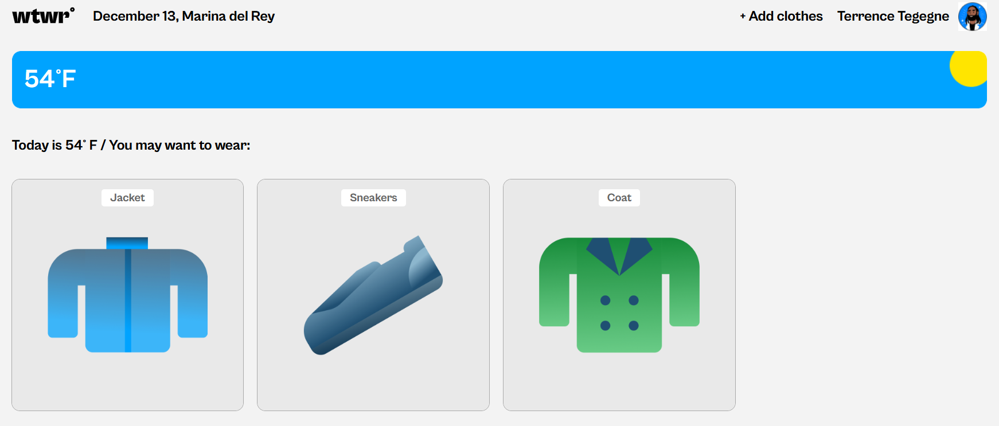
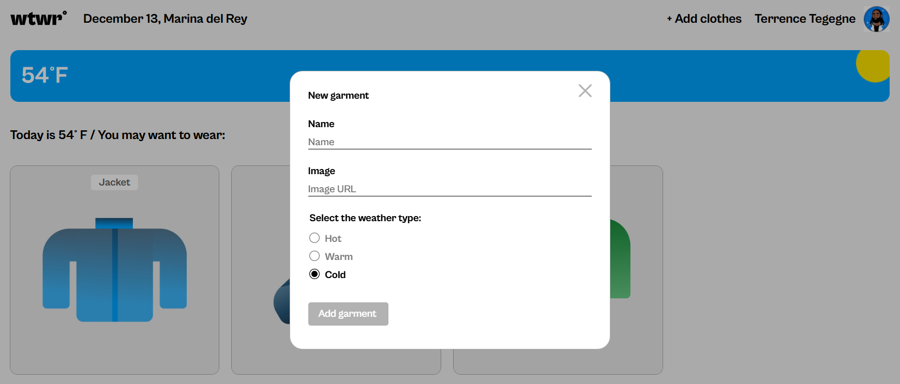
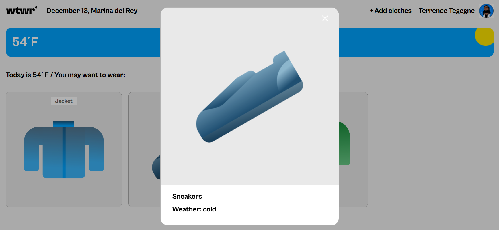

# WTWR (What to Wear?)

## About the project

The WTWR (What to Wear) app is a web application that leverages real-time weather data to provide personalzied clothing recommendations. By fetching weather information from an API, the app analyzes factors like temperature, humidity, and precipitation to suggest appropriate attire. This user-friendly tool aims to simplify daily decision-making by offering tailored clothing advice based on current weather conditions.

## Features

- Location: Location weather-specific recommendations
- Add clothing: Tailor your wardrobe for clothing recommendations based on weather forecast
- Weather forecast display: View the current weather forecast for informed decision-making

## Application screenshots

## Technologies used

- React: Developed the front-end interface
- JavaScript: Implementated core application logic and interactions
- HTML/CSS: Structured content and styling visual
- Weather API: Integrated real-time weather data for accurate recommendations
- Git: Managed project versions

### Links

- [Figma Design](https://www.figma.com/file/DTojSwldenF9UPKQZd6RRb/Sprint-10%3A-WTWR)
- [Project live Site](https://joseraiders.github.io/se_project_react/)
